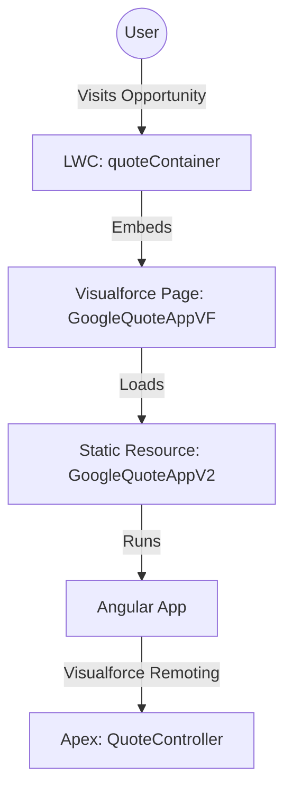

# Angular-Salesforce Integration Architecture

This document describes how the Angular application is embedded within Salesforce using an iframe architecture.

## 1. High-Level Overview

The solution involves three main layers:

1.  **Lightning Web Component (LWC)**: Acts as the parent container. It sits on the Salesforce Record Page.
2.  **Visualforce Page**: Acts as the "bridge" or host. It is embedded inside the LWC via an `<iframe>`.
3.  **Angular Application**: The actual UI. It is stored as a **Static Resource** and loaded by the Visualforce Page.



## 2. Component Roles

### A. Lightning Web Component (LWC)
**File**: `force-app/main/default/lwc/quoteContainer`

*   **Role**: The "Parent". It has access to the Salesforce UI (e.g., Record ID, Theme).
*   **Mechanism**:
    *   It renders an `<iframe>` pointing to `/apex/GoogleQuoteAppVF?id={recordId}`.
    *   **Data Passing**: It fetches initial data (Opportunity details) via Apex (`QuoteController.getAppConfig`) and sends it to the iframe using `window.postMessage`.

```javascript
// quoteContainer.js (Simplified)
handleIframeLoad() {
    const payload = { type: 'SF_CONTEXT', payload: { ...data } };
    iframe.contentWindow.postMessage(payload, '*');
}
```

### B. Visualforce Page
**File**: `force-app/main/default/pages/GoogleQuoteAppVF.page`

*   **Role**: The "Host".
*   **Mechanism**:
    *   It loads the Angular build files (`styles.css`, `main.js`, `polyfills.js`) from the Static Resource.
    *   **Initialization**: It listens for the `postMessage` from the LWC *OR* it can fetch data itself via Visualforce Remoting if loaded directly.
    *   **Bridge**: It exposes `Visualforce.remoting.Manager` which allows Angular to call Apex methods asynchronously without page refreshes.

```html
<!-- GoogleQuoteAppVF.page -->
<apex:page>
    <app-root></app-root>
    <script src="{!URLFOR($Resource.GoogleQuoteAppV2, 'main.js')}"></script>
    <script>
        // Listens for LWC message
        window.addEventListener('message', (event) => {
            if (event.data.type === 'SF_CONTEXT') {
                initContext(event.data.payload);
            }
        });
    </script>
</apex:page>
```

### C. Angular Application
**File**: `src/app/` (Source) -> `dist/` (Build)

*   **Role**: The "Client".
*   **Mechanism**:
    *   It is a standard Angular Single Page Application (SPA).
    *   **Service**: `SalesforceApiService` (or `ContextService`) wraps the `Visualforce.remoting.Manager.invokeAction` calls.
    *   It treats Salesforce just like any other backend API.

## 3. Why this Architecture?

1.  **Isolation**: Angular runs in its own iframe, preventing CSS conflicts with Salesforce's Lightning Design System (SLDS).
2.  **Security**: Visualforce Remoting is a secure, authenticated channel for API calls.
3.  **Flexibility**: You can use modern web technologies (Angular, React, Vue) without being restricted by LWC's specific framework rules (Locker Service).
